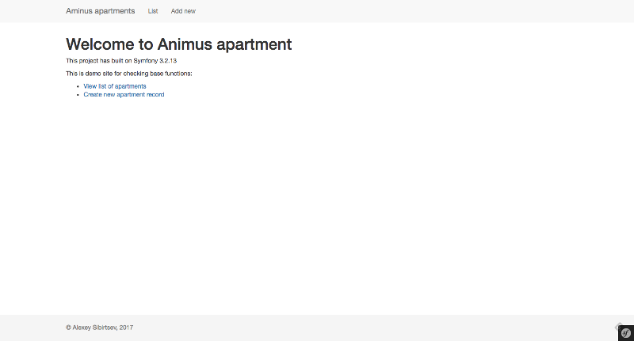
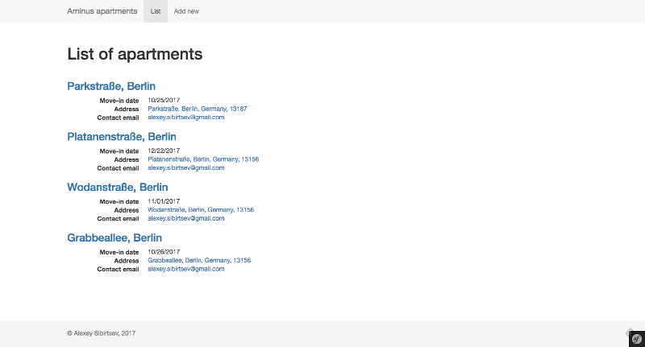
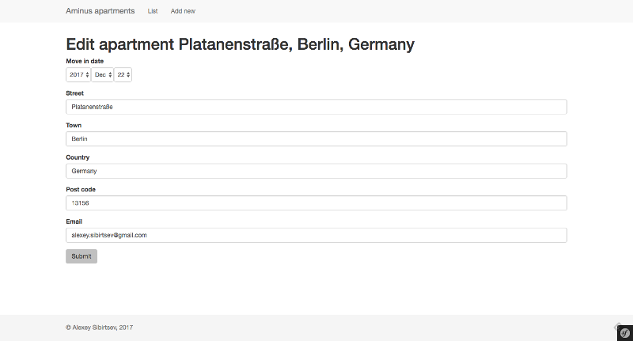
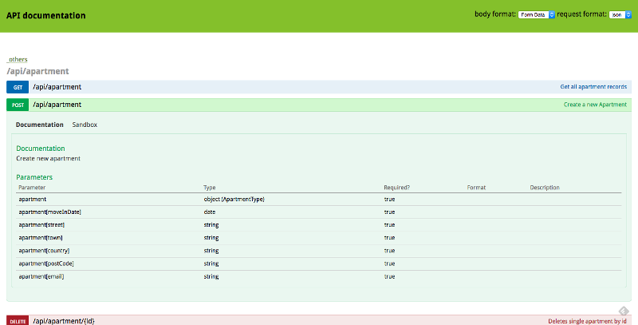
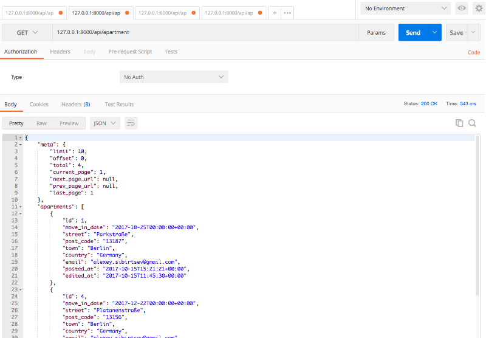

Animus Apartments
======

# Motivation
This project was built for animus.de

# Requirements
* *nix operation system (e.g. Ubuntu Linux, Mac OS)
* `php 7.1` or higher
* `mysql 5.6` or higher
* `python` (for create simple smtp debug server) 

## Requirements for inline front-end application
* `node.js`
* `yarn`

# Installation
* `make install` -- install an application and create table in database
* `make install-fe` -- install symfony-encode for demo application

# Start and stop application
* `make start` -- start backend
* `make stop` -- stop backend
* `make build-fe-prod` -- build js and css for demo application

# Project structure

## Third-party libraries
* FOSRestBundle
* JMSSerializerBundle
* NelmioCorsBundle
* NelmioApiDocBundle

## Apartment Entity

| Field | Type | Length | Description |
|-------|------|--------|-------------| 
| ID | int | 4 | Autoincrement field |
| move-in-date | date | - | Date for move |
| street | string | 255 | Street of apartment |
| post code | string | 10 | Postal code |
| town | string | 255 | City of apartment |
| country | string | 255 | Country of apartment |
| contact e-mail | email | 255 | Contact email |
| security token | string | 32 | Authorization token for edit or delete entity |
| posted at | datetime | - |  Date and time when entity was created |
| edited at | datetime | - | Date and time when entity was edited last time or deleted |

## ApartmentBundle:ApiController
Main controller of application.
### Routes
| Route name   | HTTP Method | Location            | Function |
|--------------|-------------|---------------------|----------|
|  api_list    | GET         | /api/apartment      | Get a list of apartments ordered by timestamp of creation with pagination |
|  api_view    | GET         | /api/apartment/{id} | Get an apartment by id |
|  api_create  | POST        | /api/apartment      | Create new apartment |
|  api_edit    | PUT         | /api/apartment/{id} | Update an exists apartment by id. Required secret code in HTTP headers | 
|  api_delete  | DELETE      | /api/apartment/{id} | Delete an exists apartment by id. Required secret code in HTTP headers |

## ApartmentBundle:DefaultController
Controller for testing with backend php rendering.
### Routes
| Route name   | HTTP Method | Location               | Function |
|--------------|-------------|------------------------|----------|
|  list        | GET         | /apartment/            | Page with a list of apartment with pagination |
|  view        | GET         | /apartment/view/{id}   | Page of single apartment |
|  create      | GET,POST    | /apartment/create      | Form for creation a new apartment |
|  edit        | GET,POST    | /apartment/edit/{id}   | Form for edit exists apartment by id. Required secret code in query string |
|  delete      | GET         | /apartment/delete/{id} | Location for deleting exists apartment by id. Required secret code in query string |

## Screenshots
### Main page

### List

### Edit form

### Api Documentation

### Response in Postman

## ToDo
- [x] Build skeleton for application
- [x] Build apartment entity 
- [x] Build simple controllers 
- [x] Custom validation for some fields (eg. email)
- [x] Pagination for apartments list
- [x] RESTapi
- [x] Create vue.js app (https://github.com/Sibirtsev/animus_fe)
- [x] Add Makefile
- [x] Add shell scripts for start and stop application
- [x] README.md
- [ ] Migrations
- [ ] Image upload
- [ ] Custom error pages
- [ ] Extract symfony service from controller
- [ ] Unit tests
- [ ] Nginx
- [ ] Dockerize app
- [ ] Docker compose